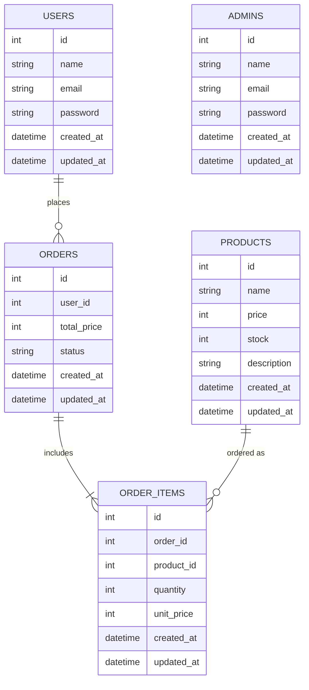

```mermaid
erDiagram

    USERS ||--o{ ORDERS : "places"
    ORDERS ||--|{ ORDER_ITEMS : "includes"
    PRODUCTS ||--o{ ORDER_ITEMS : "ordered as"

    USERS {
        int id
        string name
        string email
        string password
        datetime created_at
        datetime updated_at
    }

    ADMINS {
        int id
        string name
        string email
        string password
        datetime created_at
        datetime updated_at
    }

    PRODUCTS {
        int id
        string name
        int price
        int stock
        string description
        datetime created_at
        datetime updated_at
    }

    ORDERS {
        int id
        int user_id
        int total_price
        string status
        datetime created_at
        datetime updated_at
    }

    ORDER_ITEMS {
        int id
        int order_id
        int product_id
        int quantity
        int unit_price
        datetime created_at
        datetime updated_at
    }
```
